# Modèle entité-association

Le modèle entité-association (en anglais, *entity-relationship* ou *ER*)
est une notation graphique qui permet de décrire un modèle de données en
termes d'**entités**, d'**associations** et d'**attributs**.

## Entité (*entity* ou *entity set*)

Une **entité** représente un type ou une classe d'« objet ». Ces objets
peuvent être concrets ou abstraits, animés ou inanimés, mais ils doivent
tous être caractérisés par les même **attributs**. Par exemple, dans le
contexte d'une école, `Élève`, `Enseignant·e`, `Cours` et `Classe`
peuvent être considéré·es comme des entités.

On représente graphiquement une entité par un carré dans lequel est
indiqué son nom.

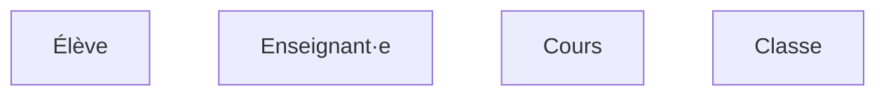

## Attribut (*attribute*)

Un **attribut** permet de décrire une entité. Le choix des attributs
reflète le niveau de détail auquel les entités seront décrites. Chaque
attribut a un **type** (*domain*, en anglais) : numérique (*int* ou
*float*), texte (*char* ou *string*), date, booléen, etc. Par exemple,
l'entité `Élève` peut avoir les attributs `NumÉlève` (numérique), `Nom`
(texte) et `CoteR` (numérique).

On représente graphiquement un attribut par un cercle ou un oval lié à
l'entité à laquelle l'attribut appartient, et dans lequel est indiqué le
nom de l'attribut. Si une entité contient beaucoup d'attributs, on peut
également lister ceux-ci à l'intérieur du carré de l'entité.

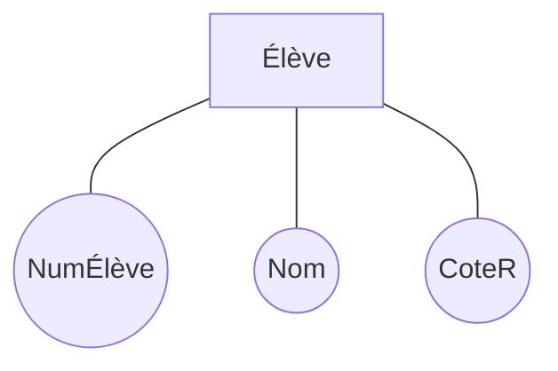

## Identifiant (*key*)

Chaque entité a un attribut ou un ensemble d'attributs dont les valeurs
permettent d'identifier de manière unique chacune de ses **instances**.
Par exemple, étant donné une valeur quelconque de `NumÉlève`, on a la
garantie qu'il n'y aura, à aucun moment, pas plus d'un ou une élève
possédant cette valeur.

Une entité peut posséder plusieurs **identifiants**. L'un d'eux est
déclaré **primaire** (*primary key*, en anglais), tandis que tous les
autres sont **secondaires** (*candidate keys*).

On identifie graphiquement l'identifiant primaire d'une entité en
sous-lignant le ou les attributs qui permettent de distinguer celle-ci.

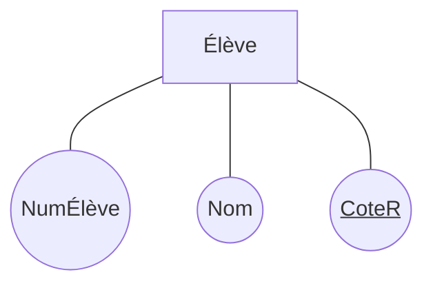

## Association (*relationship*)

Les entités sont reliées entre-elles par des **associations** : un ou
une `Élève` *suit* un ou plusieurs `Cours` ; un ou une `Enseignant·e`
*enseigne* un `Cours`, etc. Vous remarquerez que les associations sont
souvent des verbes, alors que les entités sont souvent des noms.

Une association est représentée graphiquement par un losange ou un
hexagone lié aux entités qui en font partie, et dans lequel est indiqué
son nom.

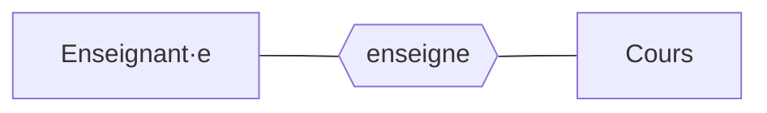

Une entité peut faire partie de plusieurs associations, tout comme une
association peut joindre entre-elles plus de deux entités. Par exemple,
un ou une `Enseignant·e` *enseigne* un `Cours` dans une `Classe`.

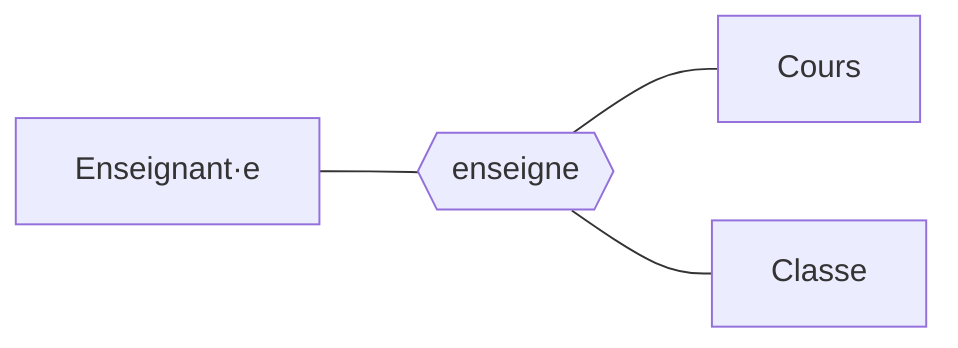

Une association peut également être reliée à une seule entité. Ainsi, un
ou une `Élève` peut *donner du tutorat* à un ou une autre `Élève`. On
qualifie ce type d'associations de « **cyclique** ».

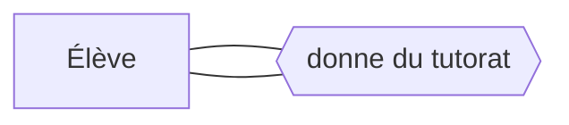

## Cardinalité

En plus de représenter les entités et les associations d'un modèle de
données, il est possible d'indiquer à combien d'associations chaque
entité peut et doit participer. Cette contrainte, nommée **cardinalité**,
est représentée par deux propriétés : la **classe fonctionnelle** et le
caractère **obligatoire ou facultatif** d'une association.

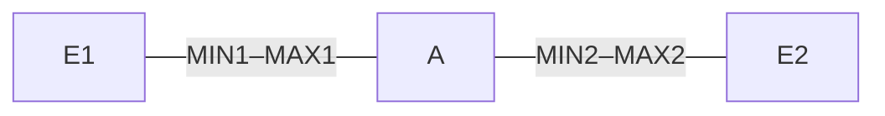

Le diagramme ci-haut se lit comme suit : Une instance de l'entité `E1`
est associée à au moins `MIN1` et au plus `MAX1` instances de l'entité
`E2`. Pareillement, Une instance de l'entité `E2` est associée à au
moins `MIN2` et au plus `MAX2` instances de l'entité `E2`.

### Classe fonctionnelle

Cette propriété décrit le nombre maximum d'instances de l'entités A pour
chaque instance de l'entité B, et vice versa. Il existe trois **classes
fonctionnelles** : **un-à-plusieurs**, **un-à-un** et
**plusieurs-à-plusieurs**.

#### Un-à-plusieurs (1:N)

Dans le contexte d'un cours, un ou une enseignante enseigne à
**plusieurs** élèves, et les élèves ont **un ou une** seule enseignante.
Il s'agit donc d'une association **un-à-plusieurs**.

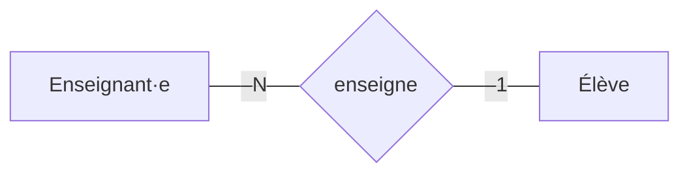

#### Un-à-un (1:1)

Dans le contexte d'une école, un casier appartient à **un ou une**
élève, et un ou une élève possède **un** seul casier. Il s'agit donc
d'une association **un-à-un**.

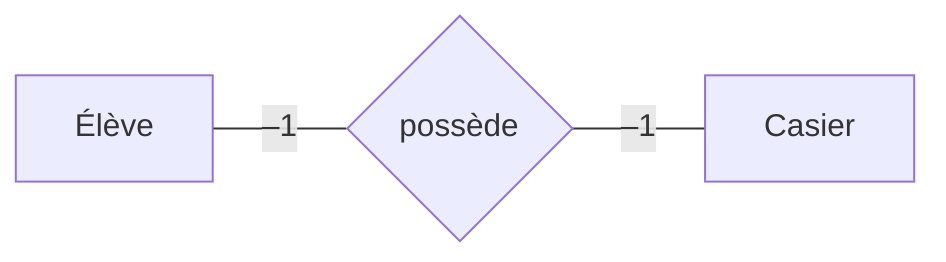

#### Plusieurs-à-plusieurs (N:N)

Dans le contexte d'un programme scolaire, un ou une élève suit
**plusieurs** cours, et un cours peut être suivi par **plusieurs**
élèves. Il s'agit donc d'une association **plusieurs-à-plusieurs**.

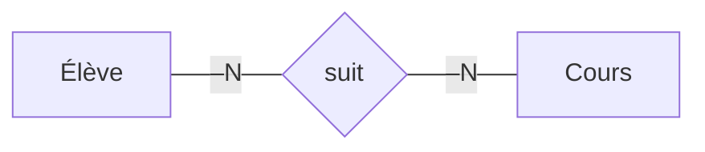

#### Important

On ne peut caractériser la classe fonctionnelle d'une association
qu'après avoir répondu à deux question :

1.  Combien d'instances de l'entités A il y a-t-il pour chaque instance
    de l'entité B ?
2.  Combien d'instances de l'entités B il y a-t-il pour chaque instance
    de l'entité A ?

### Obligatoire ou facultatif

Certaines associations sont **obligatoires** pour le ou les entités qui y
participent. Par exemple, un cours doit obligatoirement être enseigné par
un ou une enseignante.

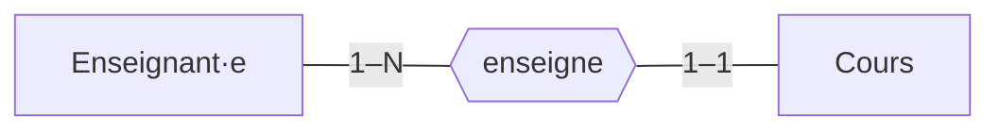

De la même façon, certaines associations sont **facultatives** pour le ou
les entités qui y participent. Par exemple, tous les élèves n'offrent ni
ne nécessitent du tutorat.

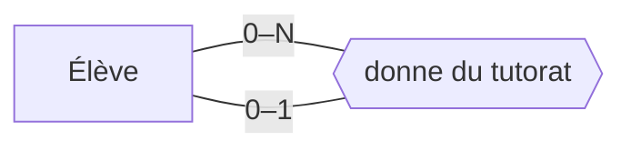

## Bibliographie

-   Jean-Luc Hainaut. Bases de données. Concepts, utilisation et
    développement. Dunod, 2018.
-   Raghu Ramakrishnan, Johannes Gehrke. Database Management Systems.
    McGraw-Hill, 2003.
